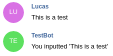

# telegram-bot
This project is a simple telegram bot that replies the text of the message that was inputted. 
It's not a big deal, it was made just to comprehend how does a telegram bot work.

Example of bot running:

 
## Running the bot
First of all, it is necessary to create your own bot on telegram and generate its token. 
This can be made by following [this documentation](https://core.telegram.org/bots#3-how-do-i-create-a-bot).

Then it is necessary to create Docker image: `docker build -t telegram-bot .`

Finally, you can start the container with the bot running: `docker run -it --name telegram-bot telegram-bot python setup.py <telegram_token>`

Just for reference, this is a revoked token that is necessary to start the bot `688728785:AAEBFK6Dp2FM4u1FUxxIcqJg_n8iAxZICJU`

If there was no error, the message `Your bot is running...` will be shown on console.

## References
* https://core.telegram.org/bots
* https://telepot.readthedocs.io/en/latest/
* https://github.com/nickoala/telepot/tree/master/examples
